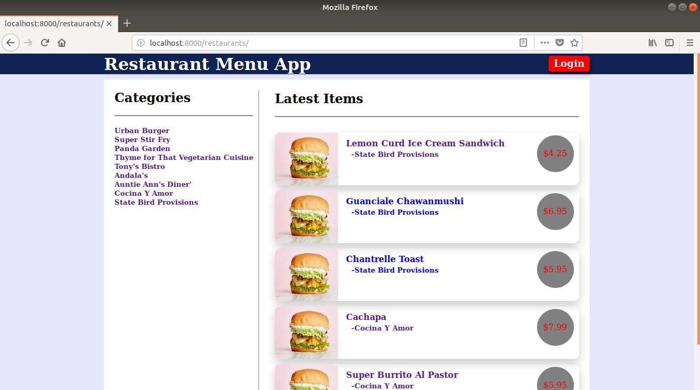
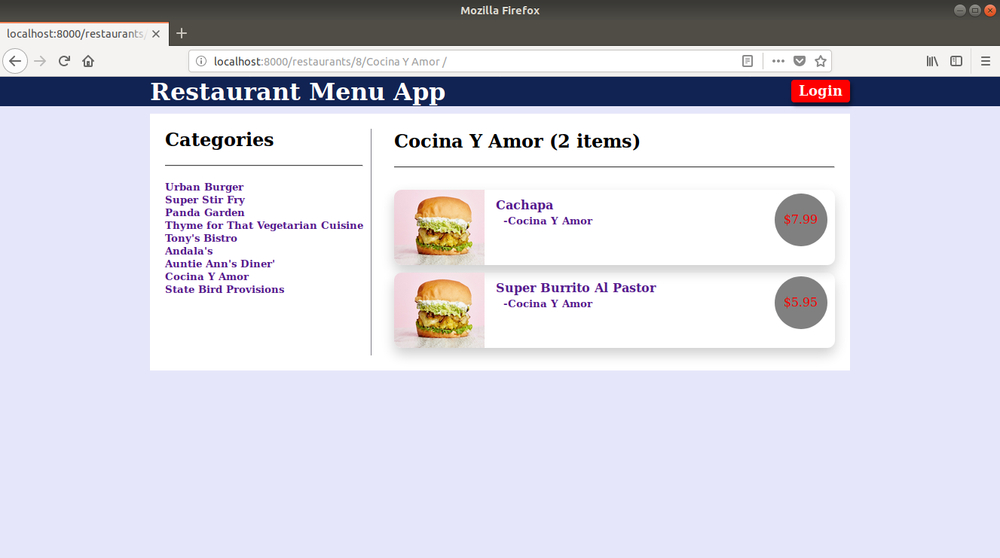
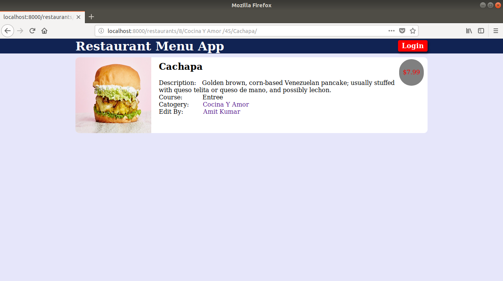
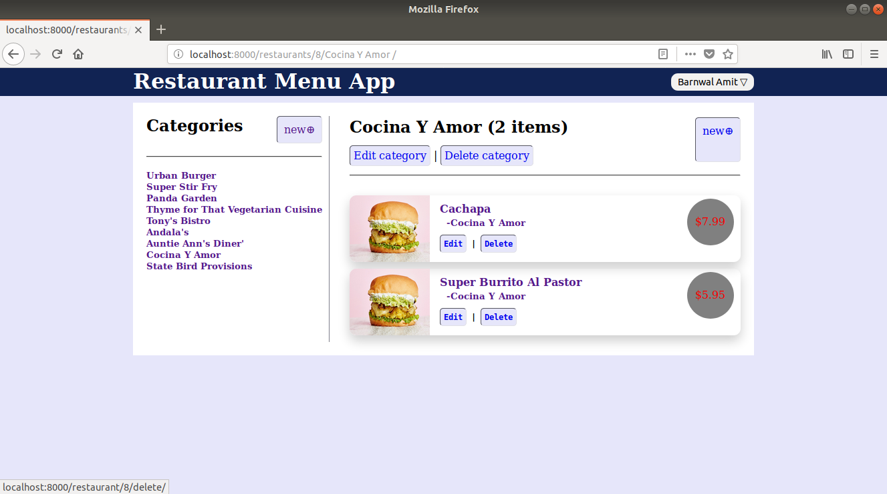
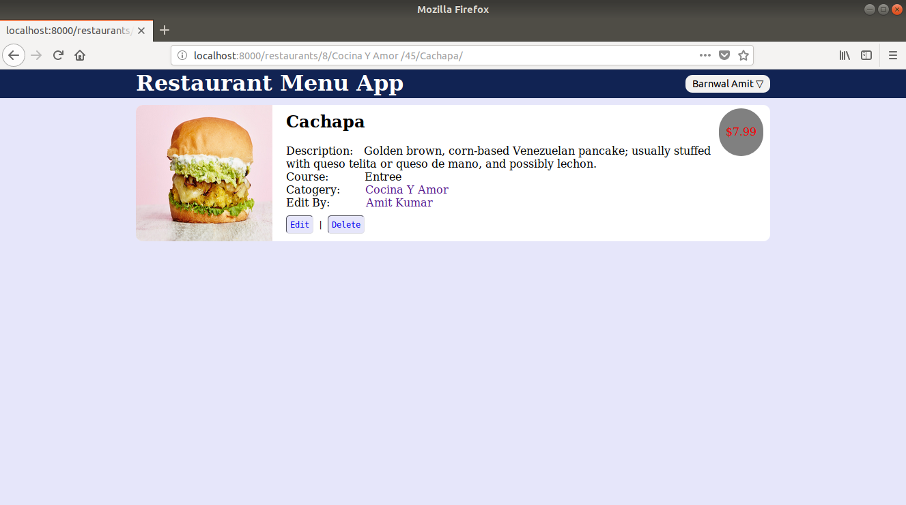
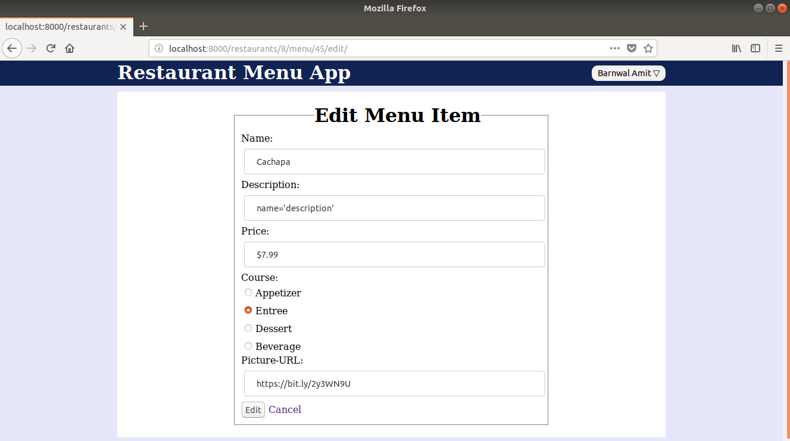
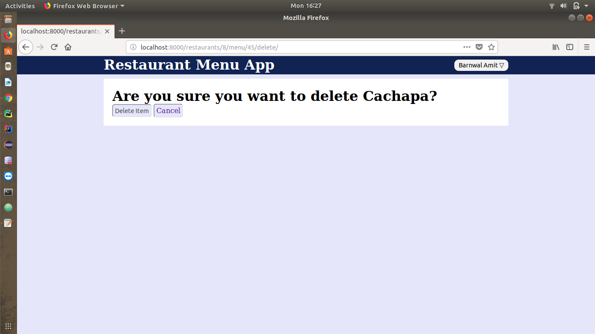
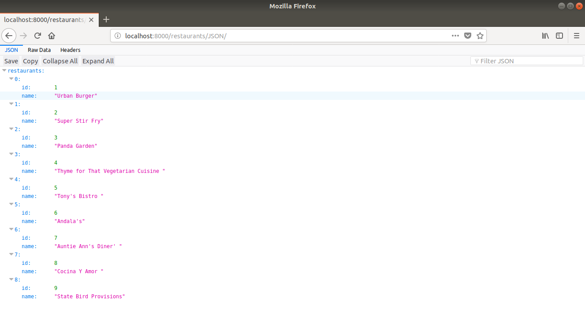

# Restaurant Menu App
*Udacity Item Catalog*

## Content Of Table
* [Introduction](#introduction)
* [Getting Started](#getting-started)
* [Project Display Example](#project-display-example)

# Introduction
In this project, you will be developing a web application that provides a list of items within a variety of categories and integrate third party user registration and authentication. Authenticated users should have the ability to post, edit, and delete their own items.  
&nbsp;&nbsp;&nbsp;&nbsp;&nbsp;&nbsp;You will be creating this project essentially from scratch, no templates have been provided for you. This means that you have free reign over the HTML, the CSS, and the files that include the application itself utilizing Flask.

# Getting Started
1. Install [Vagrant](https://www.vagrantup.com/) and [VirtualBox](https://www.virtualbox.org/wiki/Download_Old_Builds_5_1)
2. Clone the [fullstack-nanodegree-vm](https://github.com/udacity/fullstack-nanodegree-vm) repository.
3. clone the [Item Catalog Application](https://github.com/Amit2197/Item_Catalog_Application) repository from github
4. type vagrant up and vagrant ssh in your terminal
    >`vagrant up`  
    `vagrant ssh`
5. Copy project files locally in the vagrant/Item_Catalog_Application directory.
6. Run application within the virtual machine type (in terminal).  
   >`python /vagrant/Item_Catalog_Application/application.py`
7. Access and test website by visiting [http://localhost:8000](http://localhost:8000).

# Project Display Example
>In this sample project, the homepage displays
 all current categories with the latest added items.

>Selecting a specific category shows you
 all the items available for that category.

>Selecting a specific item shows you specific
 information about that item.

>After logging in, a user has the ability to add,
 update, or delete item information. Users should
  be able to modify only those items that they
   themselves have created.

>Note that the link is
 [‘http://localhost:8000/catalog/Snowboarding/Snowboard’](http://localhost:8000/catalog/Snowboarding/Snowboard).
  This is to ensure ease of readability.

>The application should provide a JSON endpoint at the very least.

